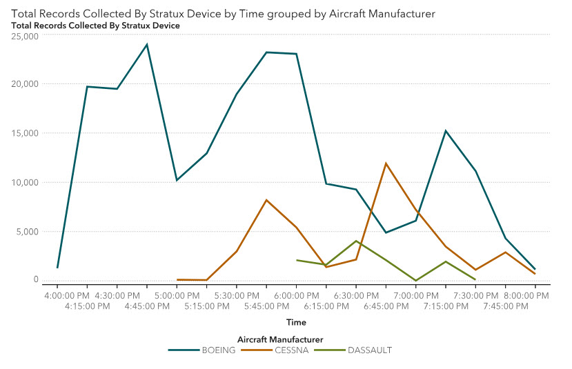

This collection provides a combination of [SAS Viya](https://developer.sas.com/apis/rest/) and [Cloud Analytics Services (CAS)](https://developer.sas.com/apis/cas/rest/current/apidoc.html) REST APIs. The collection creates a session loads data, runs base stats, and generates and retrieves a report image. These funcitons are particularly useful for SAS developers who are making updates to a report's data source(s) and would like to get a quick view of how these data changes are reflected in Visual Analytics.  More information on the reportImages service can be found on [developer.sas.com](https://developer.sas.com/apis/rest/Visualization/#report-images)

The image below shows an SVG image of a SAS Visual Analytics report (created via the reportImages service) and is the image returned from the API call.

### SAS Prerequisites
* Report's data source [data_on_the_fly](./data_on_the_fly.sas7bdat) is exists in a CASLIB
* Either upload the [DataOnTheFlyReport.json](./DataOnTheFlyReport.json) file to SAS or create a report using the data_on_the_fly.sashdat file with the following parameters:
    * Category = Time
    * Measure = Total Records Collected by Stratux Device
    * Group = Aircraft Manufacturer
    * Filter Manufacturer = BOEING, CESSNA, DASSULT
    
### Postman Prerequisites
* Create an environment with the following variables:
    * encoded_id_secret - base64 encoded value of client_id:client_secret
    * OAUTH_USERNAME - SAS username
    * OAUTH_PASSWORD - SAS password
    * sasserver - name of the SAS server formatted for connection i.e., https://mysasserver.sas.com
    
### Notes
* The data and use case for this collection was built from [Michael Drutar's SAS Communities article](https://communities.sas.com/t5/SAS-Communities-Library/How-to-create-animated-line-charts-that-quot-grow-quot-in-SAS/ta-p/500447) and [Joe Furbee's SAS Users blog post](https://blogs.sas.com/content/sgf/2018/10/31/sas-viya-rest-apis-to-access-images-from-sas-visual-analytics/).
* By default, the reportImages service renders an SVG image of the first tab in a Visual Analytics report.  If you would like to create an SVG image of a different tab you can do so by adding the sectionIndex parameter to the API call.  More information on the reportImages service parameters can be found on [developer.sas.com](https://developer.sas.com/apis/rest/Visualization/#operations-2)

